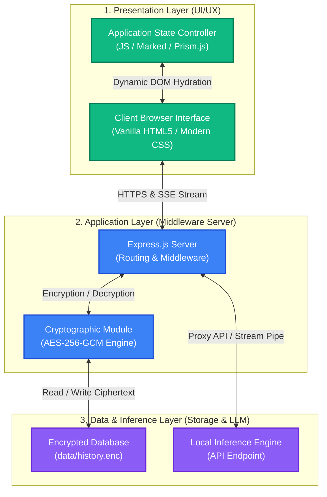

<p align="center">
  
</p>

<h1 align="center">Jellymint Chatbot</h1>

> A premium, privacy-focused local AI assistant client offering a high-fidelity interface and secure, authenticated chat history storage.

Jellymint is a secure and elegant local LLM client designed to run completely on your own machine. It balances developer-centric features (such as syntax highlighting and streaming responses) with defense-grade cryptographic history storage (AES-256-GCM). All conversations remain local, private, and encrypted.

---

## 🏛️ 3-Dimensional (3D) Architecture

Jellymint is built upon a **3-Tier (3D) Architecture** that enforces a separation of concerns between visual presentation, request coordination, and security-critical execution:



### 1. Presentation Dimension (Frontend Client)
*   **User Interface**: Built using vanilla HTML5 and custom responsive CSS3, styled with a modern glassmorphic theme and high-fidelity typography (*Outfit* for UI elements, *JetBrains Mono* for code views).
*   **Markdown Parsing & Highlighting**: Integrates `marked.js` for fast document rendering and `Prism.js` to provide real-time code block syntax highlighting.
*   **Interface Controller**: Custom event-driven JavaScript coordinates UI states (loading, streaming, collapse/expand sidebar, model picking, and connectivity alerts) without external framework dependencies.

### 2. Application Dimension (Node.js Middleware)
*   **Express Proxy Server**: Decouples the client browser from direct network connection to the local inference backend. This protects browser requests from CORS blocks and implements stream piping.
*   **Automated Setup**: On initial launch, the server checks for local environment configurations and automatically generates a secure cryptographic key if none is present.

### 3. Data & Inference Dimension (Security & Storage)
*   **Authenticated Encryption**: Chat histories are stored under `data/history.enc` encrypted via **AES-256-GCM**. This secures the conversation logs offline, protecting against third-party access or modifications.
*   **Local Inference Engine**: Communicates directly with your locally hosted AI model service via standard loopback ports to stream token responses.

---

## ⚙️ How It Works (Working Mechanism)

The operational lifecycle of Jellymint proceeds as follows:

```
[Server Startup] -> [Env Check] -> [Generate/Load Key] -> [Express Listening]
                                                                |
[Client Load] <-------------------------------------------------+
      |
      +---> 1. Fetch Available Models -----> (Express Proxies request to Inference Server)
      +---> 2. Decrypt & Load History <-----+ (Server deciphers history.enc with AES-256-GCM)
      |
[User Sends Prompt]
      |
      +---> Post Message payload to /api/chat
      +---> Server proxies request to Local Inference Engine
      +---> Stream response tokens via NDJSON back to Client UI
      +---> Save updated chat logs (Client -> Express -> Encrypt -> history.enc)
```

### Cryptographic Security (AES-256-GCM)
When saving or loading chat histories, Jellymint processes data using Node's native `crypto` module:
1.  **Encryption**:
    *   Generates a cryptographically strong, random 12-byte **Initialization Vector (IV)** for each write operation.
    *   Encrypts the JSON string of your chat logs using the 32-byte (256-bit) Hex key.
    *   Retrieves an **Authentication Tag** to verify data integrity upon read.
    *   Saves the resulting output as a structured JSON object containing `{ iv, tag, ciphertext }`.
2.  **Decryption**:
    *   Reads the stored JSON object.
    *   Initializes the decipher using the shared Key and the recorded IV.
    *   Applies the Authentication Tag. If the tag doesn't match (indicating the file was tampered with or the key is incorrect), it safely errors out, preventing corrupted reads.

---

## 🛠️ The Development Process

Jellymint was developed in sequential phases focusing on stability, visual feedback, and strong security defaults:

*   **Phase 1: Architecture Design & Foundation**
    *   Set up a clean, framework-less frontend and Node.js backend directory structure.
    *   Established global styling tokens, dynamic sizing for input textareas, and collapsible navigation bars.
*   **Phase 2: Cryptographic Infrastructure**
    *   Designed the AES-256-GCM helper functions to secure JSON payloads.
    *   Developed self-healing environment features: on-boot key creation writes configuration parameters directly to a `.env` file without manual intervention.
*   **Phase 3: Connection Proxying & Streaming**
    *   Built streaming endpoints supporting `ndjson` (Newline Delimited JSON).
    *   Piped chunks from the local inference port directly to the UI, enabling typing-effect responses.
*   **Phase 4: Client Enhancements & Error Handling**
    *   Added Prism.js syntax copy-to-clipboard buttons and connection-state indicators.
    *   Created fallback logic for model selectors to automatically pre-select active installed models.

---

## 🚀 Getting Started

### Prerequisites
*   Node.js (v18 or higher recommended)
*   A local inference backend running on your machine (configured to accept connections on port `11434` or custom ports)

### Installation
1.  Clone the repository to your local directory:
    ```bash
    git clone https://github.com/your-username/jellymint.git
    cd jellymint
    ```

2.  Install the required Node.js dependencies:
    ```bash
    npm install
    ```

3.  Configure your environment parameters:
    *   The application includes an `.env.example` template. You can copy it as `.env`:
        ```bash
        cp .env.example .env
        ```
    *   Alternatively, run the start command directly. Jellymint will detect the missing `.env` file, generate a secure random 256-bit encryption key, and write default configurations for you.

### Configuration
Your `.env` file exposes the following properties:
*   `PORT`: The port on which the web server runs (defaults to `3000`).
*   `OLLAMA_HOST`: The endpoint URL of your local AI inference backend (defaults to `http://127.0.0.1:11434`).
*   `ENCRYPTION_KEY`: A 64-character hexadecimal string representing the 32-byte AES key. Keep this private.

### Running the Application
To run the server in production mode:
```bash
npm start
```

For developer watch mode (restarts the server automatically on code changes):
```bash
npm run dev
```

Open your browser and navigate to `http://localhost:3000` to start using Jellymint.

---

## 📄 License
This project is licensed under the MIT License - see the LICENSE file for details.
